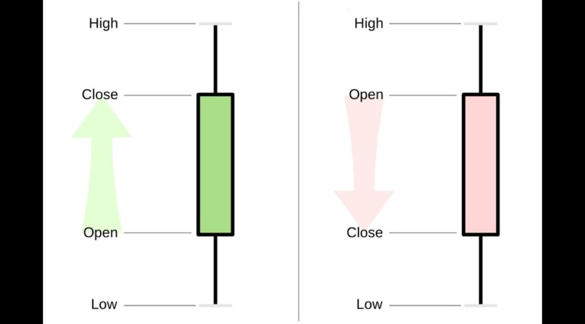

# StockNotify

StockNotify is a telegram bot which can be deployed for intraday signals and time periods above. This program allows user to set triggers on stock prices.

In stock markets, traders/investors need to know when a certain stock crosses their desired price tag. This can be done by using paid services which allow users to set these triggers.
Using python and a few libraries, this can be achieved free of cost.

## Background

Every stock has 4 prices associated with it in a given time frame, they are:
- Open
- High
- Low
- Close

Of these, close price is most sought after and that's what is being used in this project. 

A trader analyses stock patterns in different time periods such as 1 minute, 2 minutes, 5 minutes, 10 minutes, 30 minutes, and the list goes on and on. Basically, any time period less than the number of hours stock exchange remains open(5 hours in india) is called as intraday.

## API(s)
1. Alpha Vantage Stock Market API: This API is used to get intraday stock prices, but it offers only 5 free requests/hour and capped at 500 requests/day. 
2. yfinance: This is a python wrapper for the Yahoo finance API and is widely used by developers. It provides data for most stocks with time period no less than a day.

## Database:
For this project, MongoDB has been used as a database because of it's NoSQL nature and easy setup.

## Setup
Make sure mongoDB is installed and service is running in your PC, check installation instructions [here](https://docs.mongodb.com/manual/installation/).
Create the mongoDB schema by following [this guide](./MONGODB_SCHEMA.md)
- Fork and star this repository.
- Clone the fork to your local machine.
- `cd` into project directory.
- Create virtual environment, `python3 -m venv venv`
- Activate the environment, `source venv/bin/activate`
- Install the requirements, `pip3 install -r requirements.txt`
- Follow [this guide](./MONGODB_SCHEMA.md) to place your API tokens.
- Run the app, `python3 app.py`
- Open the telegram app, navigate to the bot chat and send `/start `

## Contributors, here👇
Contributors are most welcome, head over to the [CONTRIBUTING guide](CONTRIBUTING.md)
